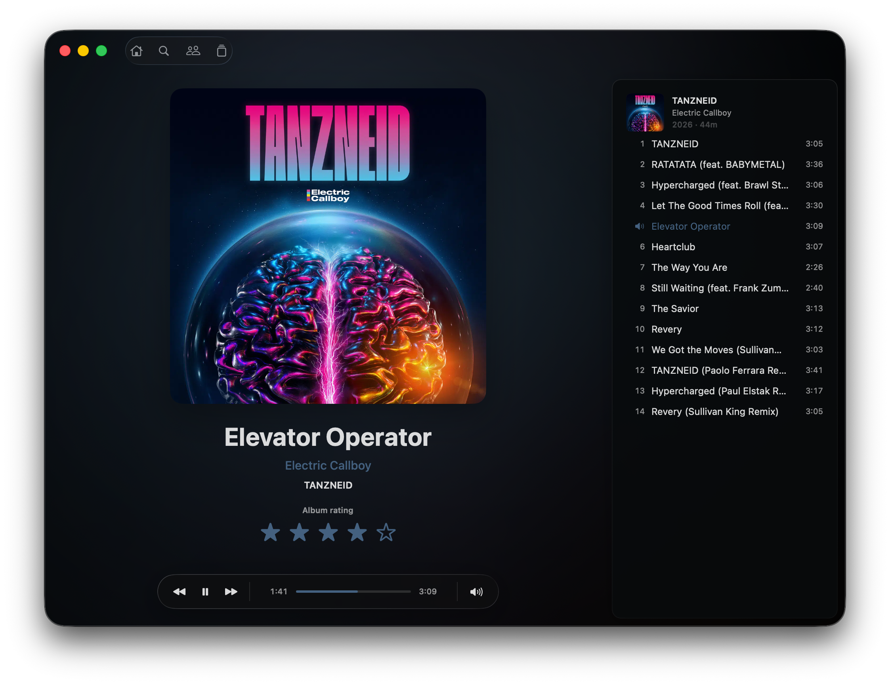
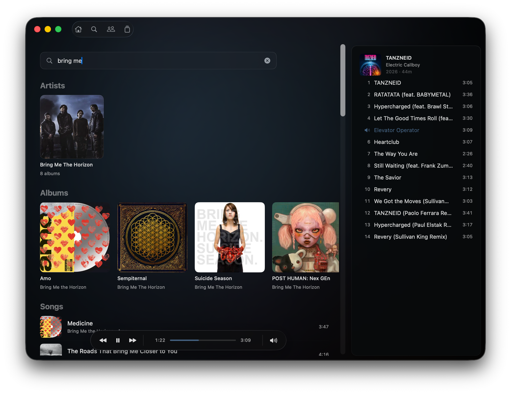

# Coda — Album-First Navidrome Client for macOS

Coda is a focused native macOS client for Navidrome and compatible OpenSubsonic servers. It keeps
artwork, albums, and the listening queue at the center of the experience.

Coda is an independent community project and is not affiliated with or endorsed by Navidrome.

<p align="center">
  
  
</p>

<p align="center">
  
  
</p>

## Highlights

- Artwork-led native macOS design with album-derived colors and Liquid Glass controls.
- Album-first browsing with chronological discographies, multidisc releases, ratings, and search.
- A visible, editable queue with drag-and-drop insertion, reordering, removal, and queue handoff.
- Original-format playback with gapless transitions, seeking, scrobbling, and saved queue restoration.
- Native media keys, macOS Now Playing integration, and a dedicated immersive Now Playing view.

## Requirements

- macOS 26 or newer on an Apple silicon Mac.
- A Navidrome server or compatible OpenSubsonic implementation.
- Network access to that server; HTTPS is recommended outside a trusted network.

## Artwork performance

Coda requests 500 px artwork while browsing and 1200 px artwork for Now Playing. A 500 MB
macOS-managed response cache keeps recently viewed covers quick when scrolling away and back, but
the server's transformed-image cache remains important for large libraries.

Navidrome defaults `ND_IMAGECACHESIZE` to only `100MB`. Once that cache fills, repeatedly resizing
artwork can cause high server CPU use and slow browsing even over a fast local network. `1GB` is a
reasonable starting point; `5GB` to `10GB` may suit large artwork libraries when server storage
allows it. Values require explicit units. For example, in Docker Compose:

```yaml
environment:
  ND_IMAGECACHESIZE: "5GB"
```

See Navidrome's [configuration options](https://www.navidrome.org/docs/usage/configuration/options/#available-options)
for the current default and supported configuration methods. Other OpenSubsonic servers may have
an equivalent artwork or thumbnail cache setting.

## Install

Download the macOS arm64 ZIP from the latest GitHub release, extract `Coda.app`, and move it to
`/Applications`.

The app is not currently notarized. After reviewing the source, you can remove macOS quarantine
from a downloaded build with:

```sh
xattr -dr com.apple.quarantine /Applications/Coda.app
```

## Build from source

Install Xcode Command Line Tools 26 or newer, Swift 6.2 or newer, and the build dependencies:

```sh
brew install meson ninja pkg-config libunibreak graphite2 freetype fribidi harfbuzz libpng
```

Then build and open the release app:

```sh
./scripts/build-app.sh release
open .build/Coda.app
```

Run the automated tests with:

```sh
swift test
```

## Privacy

Coda contains no analytics, advertising, or tracking SDK. It communicates only with the server
configured by the user.

Artwork responses are stored in a macOS-managed disk cache. OpenSubsonic authentication values
are part of artwork request URLs, so the cache's private on-disk metadata may include those URLs.
Anyone able to read the cache already has local filesystem, backup, or malware-level access;
nevertheless, use a strong server password and protect access to the Mac and its backups.

## License

Copyright 2026 iamtoolino.

Coda's source code is licensed under the [Apache License, Version 2.0](LICENSE). Bundled libraries
retain their respective licenses; their notices are included in the built app.
