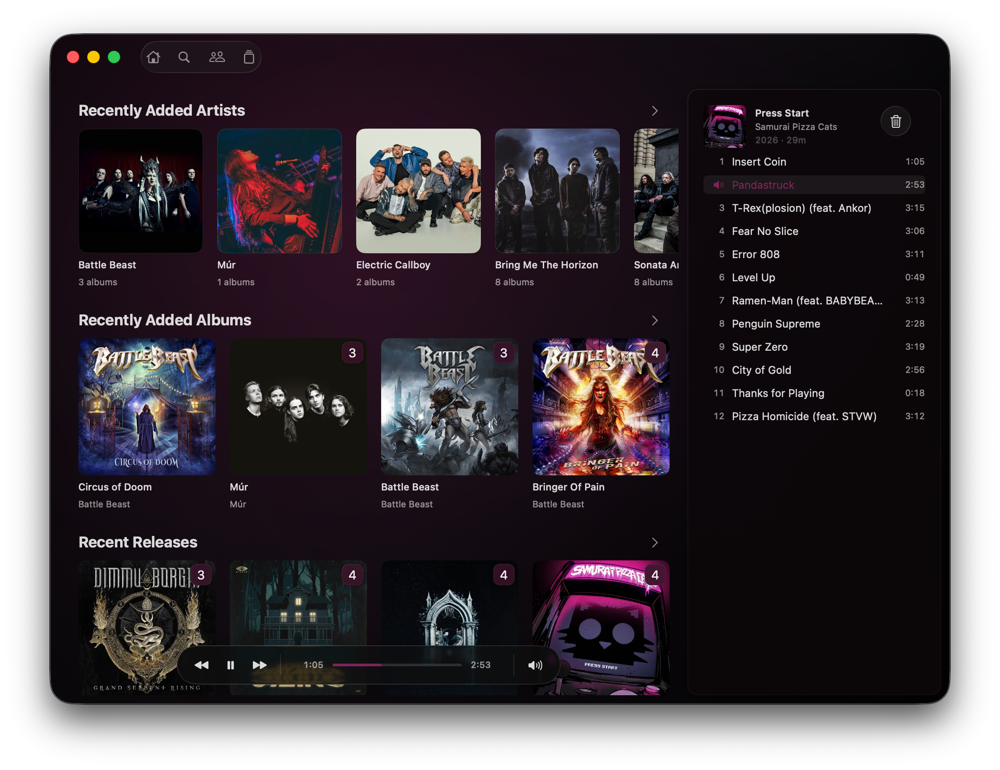
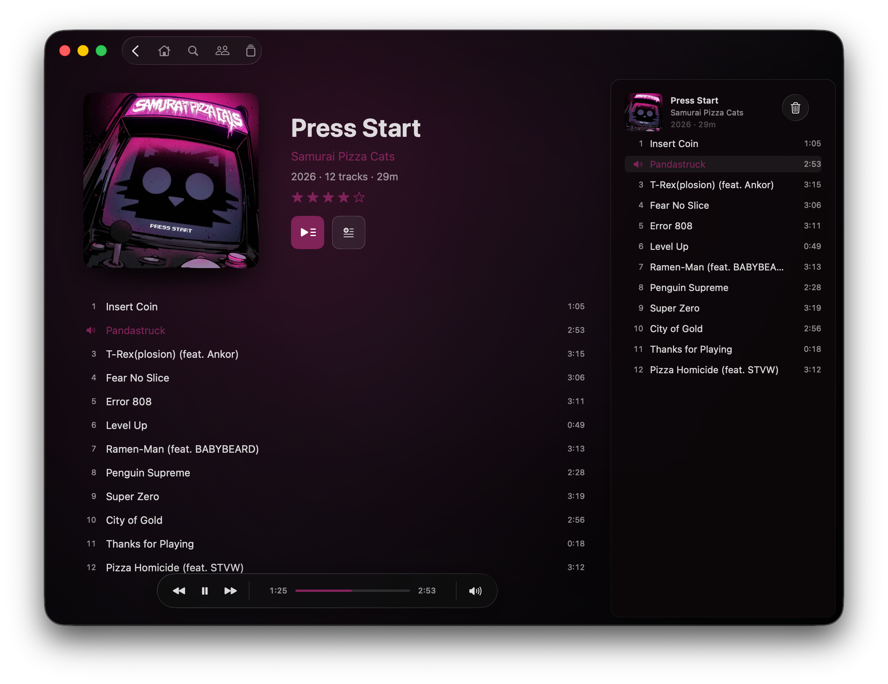

# Coda — Album-First Navidrome Client for macOS

Coda is a focused, album-first macOS client for Navidrome and compatible OpenSubsonic servers. It
is built for people who want the artwork and the music to lead, while the player itself stays fast,
predictable, and out of the way.

Coda is an independent community project and is not affiliated with or endorsed by Navidrome.

<p align="center">
  
  
</p>

## Why Coda exists

Coda is for listeners who still think in artists, albums, discs, and track lists. It turns a
Navidrome library into a calm, native Mac experience where the artwork gives every album its own
identity.

- **Artwork is the design.** The current album supplies the color and atmosphere; Coda adds as
  little visual noise as possible.
- **Albums come first.** Discographies, multidisc releases, ratings, and a real editable queue are
  treated as essential parts of listening rather than secondary library details.
- **Navigation stays predictable.** Home, Search, Artists, and Albums are always familiar starting
  points, so moving through the library remains effortless.
- **Your server stays current.** Coda reads the library directly from Navidrome, so new albums,
  changed playlists, and ratings are available without waiting for a library synchronization.
- **Music stays in its original format.** Coda is designed for a fast connection to the server and
  plays the files already chosen for the library.

The result is a focused music player that feels at home on macOS and makes a personal library feel
personal.

## Highlights

- Artwork-derived backgrounds and accent colors with native Liquid Glass controls.
- A compact home screen for artists, recently added and recently played albums, recent releases,
  playlists, and queue continuation.
- Chronological artist discographies, sortable album collections, and ordered Artist → Album →
  Song search results.
- Album and playlist views with double-click playback, drag-and-drop queueing, and interactive
  five-star album ratings.
- Multidisc albums with per-disc headings, runtimes, optional disc subtitles, independent dragging,
  and queue removal.
- A directly editable queue: append, insert, select, delete, reorder, and jump to the playing track.
- Native media keys, macOS Now Playing integration, seeking, volume, and mouse back-button support.
- Gapless album playback powered by libmpv.
- Persistent artwork caching for fast launches and immediately responsive browsing.
- Secure login stored in the macOS Keychain.
- Queue handoff between Coda and other compatible Navidrome clients.
- Reliable Navidrome scrobbling while listening.
- A native status window for connection and build details.

## Made for complete albums

Coda streams the original files from the server and uses libmpv to keep connected tracks flowing
without an artificial pause. FLAC, Opus, MP3, AAC, and other common formats can live together in the
same library.

The queue is part of the listening experience rather than a temporary list hidden behind a button.
Albums, individual tracks, and even discs can be dragged into position, rearranged, or removed
directly.

## Pick up where you left off

Coda participates in Navidrome's shared saved queue. Reopen Coda and the queue from this Mac is ready
to restore; listen somewhere else and Coda can offer that client's queue as a clear **Continue**
card on Home.

The handoff preserves track order, the current track, and the approximate playback position. A
paused Coda monitors the server without overwriting another player's newer queue, so switching
between clients remains intentional rather than becoming a tug-of-war.

## Requirements

- macOS 26 or newer.
- An Apple silicon Mac.
- A Navidrome server or compatible OpenSubsonic implementation.
- Network access to that server.

Coda currently supports one server and one account at a time. HTTPS is strongly recommended whenever
the server is reachable over an untrusted network.

## Installing a GitHub release

Download the macOS arm64 ZIP from the GitHub Release, extract `Coda.app`, and move it to
`/Applications`.

The current release keeps Coda's stable development signing identity, but it is not Apple Developer
ID signed or notarized. macOS may therefore quarantine a build downloaded from GitHub. After
reviewing the source and moving the app into place, remove that quarantine attribute with:

```sh
xattr -dr com.apple.quarantine /Applications/Coda.app
```

This permits the downloaded build to launch; it does not make the development certificate an
Apple-trusted Developer ID. A future fully notarized distribution would require membership in the
Apple Developer Program.

## Building

Prerequisites:

- Xcode Command Line Tools 26 or newer, with Swift 6.2 or newer.
- [Homebrew](https://brew.sh).
- Meson, Ninja, pkg-config, Graphite2, FreeType, FriBidi, and HarfBuzz:

```sh
brew install meson ninja pkg-config graphite2 freetype fribidi harfbuzz
```

Clone the repository, build the pinned LGPL playback dependencies, and create a release app:

```sh
./scripts/build-libmpv.sh
./scripts/build-app.sh release
open .build/Coda.app
```

The first command downloads checksum-pinned source archives and builds Coda's playback stack under
`.build/libmpv`. The app bundles its required dynamic libraries and has no runtime dependency on
Homebrew or a separately installed `mpv` executable.

`build-app.sh` uses a code-signing identity named `Coda Local Development` when one is installed.
Set `CODA_SIGNING_IDENTITY` to use another identity. If neither is available, the script creates an
ad-hoc signed local build. Ad-hoc and locally signed builds are suitable for development, but are not
Developer ID signed or notarized for public distribution.

Run deterministic authentication, metadata, queue, playback-policy, and scrobbling checks with:

```sh
swift test
```

Test real decoding and the preloaded transition between two server tracks with:

```sh
SDKROOT="$(xcrun --sdk macosx --show-sdk-path)" \
  DYLD_LIBRARY_PATH=.build/libmpv/prefix/lib \
  swift run CodaPlaybackSpike --mpv-stream-test
```

The live stream test uses the login saved by Coda. Isolated test credentials can instead be supplied
through `CODA_SERVER_URL`, `CODA_USERNAME`, and `CODA_PASSWORD`.

## Privacy

Coda contains no analytics, advertising, or tracking SDK. Credentials are stored in the user's
macOS login Keychain and are not compiled into the app. Server communication goes only to the server
configured by the user.

## Deliberately out of scope

- Podcasts and internet radio.
- Generated mixes and recommendation algorithms.
- Permanent offline downloads and offline-library management.
- Connection-quality heuristics and automatic transcoding choices.
- Multiple simultaneous servers or user profiles.
- Light appearance and versions of macOS earlier than 26.

## Vibe-coded, openly

Coda was designed and implemented through an iterative, conversational workflow with OpenAI Codex.
The product direction, design decisions, hands-on listening tests, performance measurements, and
final judgment were human-led; a large portion of the implementation was AI-assisted. In other
words: this project was vibe-coded, deliberately and transparently.

That origin is not a substitute for review. Bug reports, code review, testing on different servers
and Macs, and focused contributions are welcome.

## License

Copyright 2026 iamtoolino.

Coda's source code is licensed under the [Apache License, Version 2.0](LICENSE). Bundled playback
libraries retain their respective licenses; their license texts are included in the built app.
